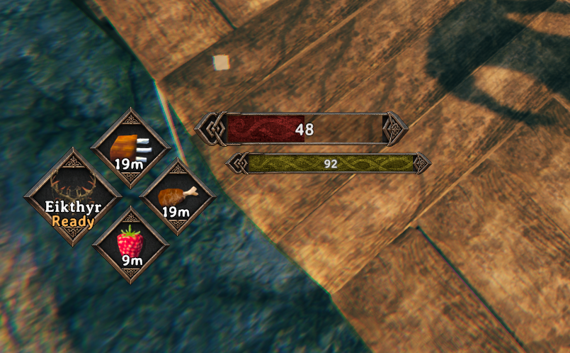
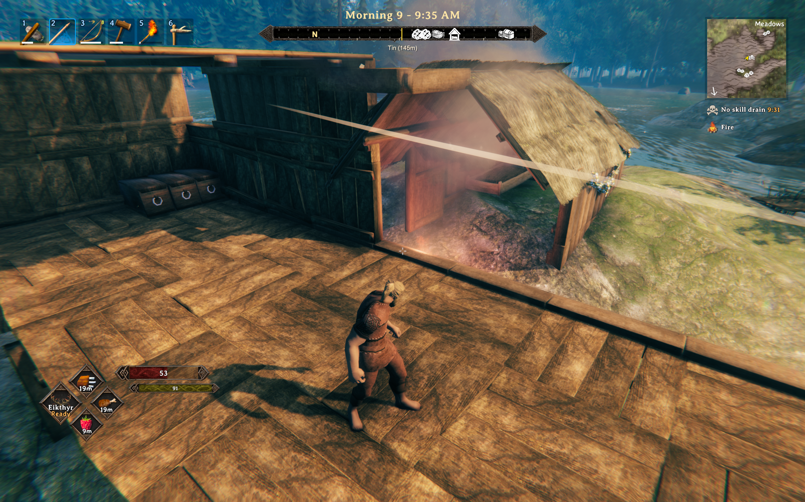

# Cartur's UI — HUD

*Free, and always will be — if it improved your game you can [tip me on Patreon](https://www.patreon.com/c/cartur).*

**[Discord](https://discord.gg/nd5RqpwNkz)** — bug reports, install help, and mod requests.
Bug reports get their own thread so nothing is lost in a chat scroll, and requests are voted on.

**More from Cartur:** [HD Blood](https://thunderstore.io/c/valheim/p/Cartur/Carturs_HD_Blood/) ·
[Map Pins](https://thunderstore.io/c/valheim/p/Cartur/Carturs_Map_Pins/) ·
[Compass and Clock](https://thunderstore.io/c/valheim/p/Cartur/Carturs_Compass_and_Clock/) ·
[Safe Stamina](https://thunderstore.io/c/valheim/p/Cartur/Carturs_Safe_Stamina/) ·
[Follow Command](https://thunderstore.io/c/valheim/p/Cartur/Carturs_Follow_Command/) ·
[Flooring](https://thunderstore.io/c/valheim/p/Cartur/Carturs_Flooring/)

A hand-drawn bronze HUD for Valheim. Norse knotwork frames on the bars, diamond frames
on the food, and every piece placed and sized by you.



Client-side. No server install needed, works in multiplayer.

## What you get

- **Health, stamina, eitr and adrenaline bars** in a sliced bronze frame that keeps its
  ornaments crisp at any length. The knotwork fill is uncovered as the bar drains rather
  than squashed.
- **Three food diamonds** with the countdown on each. A slot holding something you are
  currently digesting still shows that food's timer.
- **The guardian power** in its own frame, with the name and Ready/cooldown over the icon.
- **Eitr and adrenaline get a row each** — neither is drawn until you have that pool,
  and neither hides the other.

Bars grow with your maximum, not just your current value: eat, and the bar itself gets
longer; let the food run out and it shrinks back. Each bar reaches the same length at its
own ceiling, so a 100-point adrenaline pool reads as full as a 325-point health pool.

## Arranging it

Everything is movable. Turn on **`editMode`** in the config — with
[Configuration Manager](https://thunderstore.io/c/valheim/p/shudnal/ConfigurationManager/)
that is a tick box in game, or edit the config file in r2modman or a text editor and it
applies immediately without a restart.

| | |
|---|---|
| drag | move a piece |
| wheel | size it — bar height, or overall scale on the food and power group |
| shift + wheel | a bar's length |
| ctrl + wheel | how far the frame's ornaments stand off the fill |
| ctrl + drag | nudge the frame against the fill |

Player input is held while edit mode is on, so a drag does not swing your axe. Turn it
off when you are done; the layout saves either way and survives restarts.

The three food diamonds and the power box move together as one group. The four bars are
individual, so you can stack them how you like.



## Compatibility

Four mods are declared incompatible in the plugin itself, so BepInEx will not start the
game with this one and any of them in the same profile. It is not a load-order question —
take the other one out:

- **Auga** and **AugaLite** — they replace the same bars, panels and loading screen.
- **[Equipment and Quick Slots](https://thunderstore.io/c/valheim/p/RandyKnapp/EquipmentAndQuickSlots/)**
  and **Shield Me Bruh** — their equipment, quick and shield slots are part of this mod now.
  A character that has been through Equipment and Quick Slots keeps every worn item exactly
  where it was: the slot grid layout here is the one that mod used.

**BetterArchery** works alongside. This mod trips Better Archery's own inventory-expansion
gate so it stands down, and hosts its quiver in three ammo cells of the equipment panel, so
its arrow rules and quiver HUD keep working.

**Cartur's Waste Management** works alongside too — its trash can and sort button are seated
into the inventory's side column rather than left where they land.

This is more than a HUD, so any other mod that redraws one of these will fight it: the four
bars, the food and guardian-power boxes, the hotbar, the inventory, container, crafting and
info panels, the equipment, quick and shield slots, item tooltips, the build menu, the
skills and compendium screens, the settings and pause menus, the trader, chat and radial
menus, and the loading and sleep screens. It also draws a frame around the minimap and the
map — the map itself is left alone, the frame is one Image added beside it.

Known good alongside: Epic Loot, Jotunn.

## Config

`BepInEx/config/com.jekkle.valheim.carturuihud.cfg`

One `editMode` switch and one line per piece, written as `x,y,size,length,frameSize,frameX,frameY`.
Hand-editable if you want exact numbers — changes apply live.

## Part of a set

This is the HUD. More of the interface is coming as separate mods, so you can take the
parts you want.

## Building

```
dotnet build src\CarturUIHud.csproj -c Release
```

Deploys to the r2modman Default profile. Override with `-p:VALHEIM_INSTALL=...` or
`-p:R2MODMAN_PROFILE=...`.

```
powershell -ExecutionPolicy Bypass -File tools\pack.ps1
powershell -ExecutionPolicy Bypass -File tools
eleasecheck.ps1
powershell -ExecutionPolicy Bypass -File tools\publish.ps1 -WhatIf
```
